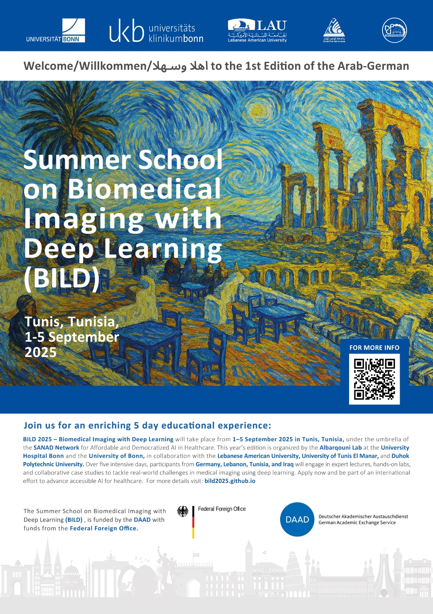

# The Practical Training for the BILD Summer School (https://bild2025.github.io/)

## Outline
1. DataLoader
2. CNN Classification
3. Segmentation
4. Quality Control
5. NVIDIA Session
6. 

## Datasets
- 

## Courses (for inspiration)
- https://albarqouni.github.io/students/courses/iml2022/
- [Udacity](https://www.udacity.com/school-of-ai)
  
## Playgrounds
- [Tensorflow — Neural Network Playground](https://playground.tensorflow.org/#activation=tanh&batchSize=10&dataset=circle&regDataset=[…]se&problem=classification&initZero=false&hideText=false) 
- [Machine Learning Playground](https://ml-playground.com/#)
- [ML Playground Linear Regression](https://mlplaygrounds.com/)
- [Image kernels](https://setosa.io/ev/image-kernels/)
- [Image Convolutional Playground](https://generic-github-user.github.io/Image-Convolution-Playground/src/)
- [K-Means Clustering Demo](https://user.ceng.metu.edu.tr/~akifakkus/courses/ceng574/k-means/)
- [DBScan visualization](https://www.naftaliharris.com/blog/visualizing-dbscan-clustering/)

## License
This project is licensed under the Attribution-NonCommercial-NoDerivatives 4.0 International (CC BY-NC-ND 4.0). See [LICENSE](LICENSE.md) for more details
